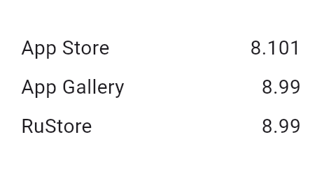

<!--
This README describes the package. If you publish this package to pub.dev,
this README's contents appear on the landing page for your package.

For information about how to write a good package README, see the guide for
[writing package pages](https://dart.dev/guides/libraries/writing-package-pages).

For general information about developing packages, see the Dart guide for
[creating packages](https://dart.dev/guides/libraries/create-library-packages)
and the Flutter guide for
[developing packages and plugins](https://flutter.dev/developing-packages).
-->

# Flutter Update Checker - A Simple Package to Check for App Updates

[](https://pub.dev/packages/flutter_update_checker_plus)
[](https://pub.dev/packages/flutter_update_checker_plus/score)

This package helps developers easily check for updates of their applications from various app stores, ensuring that users are notified about new versions with the latest features and bug fixes.



## Table of Contents

- [Features](#features)
- [Platform support](#platform-support)
- [Requirements](#requirements)
- [Getting started](#getting-started)
- [Usage](#usage)
- [Contributing](#contributing)
- [License](#license)

## Features

- Check for updates from the store where the application was downloaded.
- Retrieve the version from another store (except Google Play).
- Open links to the respective app store.

## Platform support

| Feature     |                Android                 | iOS |
| ----------- | :------------------------------------: | :-: |
| App Store   |                   ✅                   | ✅  |
| App Gallery |                   ✅                   | ✅  |
| Google Play | (Only if installed from Google Play)\* |     |
| RuStore     |                   ✅                   | ✅  |

> [!IMPORTANT]
> Google Play update checks cannot be tested locally. You must install the app via Google Play. Refer to the [official documentation](https://developer.android.com/guide/playcore/in-app-updates/test) for in-app updates.

## Requirements

- Android: Minimum SDK version 21 (API level 21) or higher.
- iOS: Minimum version 12 or higher.

## Getting started

To use this package on iOS, you must configure the `Info.plist` file to allow the app to link to the App Store. Add the following entry:

```xml
<key>LSApplicationQueriesSchemes</key>
<array>
  <string>itms-apps</string>
</array>
```

This allows your app to open App Store links correctly.

Also, ensure you are using Semantic Versioning (X.Y.Z) in your pubspec.yaml:

```yaml
version: 1.2.3+XXXXXX
```

## Usage

Refer to the example provided in the [`/example`](./example) folder for detailed usage.

Here's a simple example of how to check for updates:

```dart
import 'package:flutter_update_checker_plus/flutter_update_checker_plus.dart';

final updateChecker = UpdateStoreChecker(
      iosAppStoreId: 564177498,
      androidAppGalleryId: 'C101104117',
      androidAppGalleryPackageName: 'com.vkontakte.android',
      androidRuStorePackage: 'com.vkontakte.android',
      androidGooglePlayPackage: 'com.vkontakte.android',
    );

void checkForUpdates() async {
  try {
    // Check if an update is available
    bool isUpdateAvailable = await updateChecker.checkUpdate();
    if (isUpdateAvailable) {
      print("An update is available!");
      // Optionally open the store link
      await updateChecker.update();
    } else {
      print("You're using the latest version.");
    }

    // Get the version from the store
    String storeVersion = await updateChecker.getStoreVersion();
    print("Latest version in store: $storeVersion");
  } catch (e) {
    print("Error checking for updates: $e");
  }
}

```

## Contributing

[Feedback](https://github.com/adictgroup/flutter_update_checker_plus/issues) and [Pull Requests](https://github.com/adictgroup/flutter_update_checker_plus/pulls) are most welcome!

## License

This package is licensed under the [MIT License](https://github.com/adictgroup/flutter_update_checker_plus/LICENSE)
